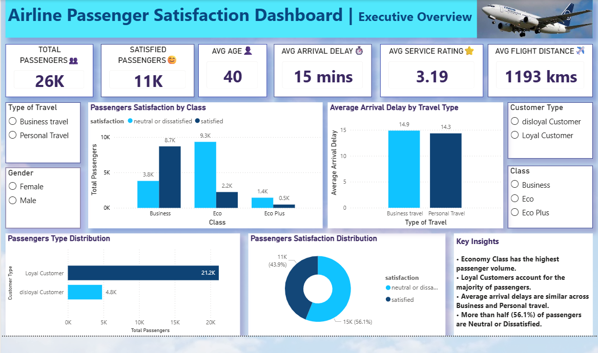
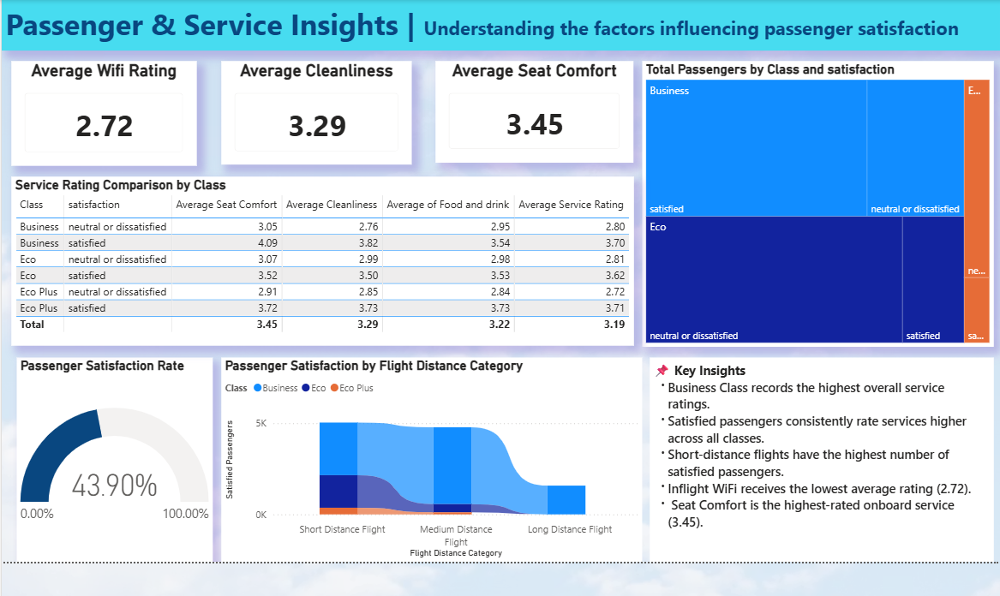

# ✈️ Airline Passenger Satisfaction Dashboard

## Project Overview

This Power BI dashboard analyzes airline passenger satisfaction using customer demographics, travel details, flight information, and onboard service ratings. The dashboard provides interactive insights into the key factors influencing passenger satisfaction and highlights opportunities for service improvement.

---

## Business Objective

To analyze passenger satisfaction and identify the major factors affecting customer experience using interactive Power BI dashboards.

---

## Tools & Technologies

- Power BI
- Power Query
- DAX
- Microsoft Excel

---

## Dataset

**Dataset:** Airline Passenger Satisfaction Dataset

---

## Dashboard Pages

## Page 1 – Executive Overview

- Total Passengers
- Satisfied Passengers
- Average Flight Distance
- Average Arrival Delay
- Passenger Distribution
- Customer Type Analysis

---

## Page 2 – Passenger & Service Insights

- Service Rating Comparison
- Treemap
- Ribbon Chart
- Satisfaction Gauge
- Service Performance Matrix

---

## Key Insights

- Business Class records the highest service ratings.
- Short-distance flights have the highest satisfied passengers.
- Inflight WiFi receives the lowest average rating.
- Seat Comfort is the highest-rated onboard service.
- Satisfied passengers consistently provide better service ratings.

---

## Dashboard Preview

### Executive Overview

## Passenger & Service Insights

---

## Skills Demonstrated

- Data Cleaning
- Data Modeling
- DAX Calculations
- KPI Development
- Dashboard Design
- Data Visualization
- Business Intelligence

---

⭐ If you found this project interesting, feel free to explore the repository!
